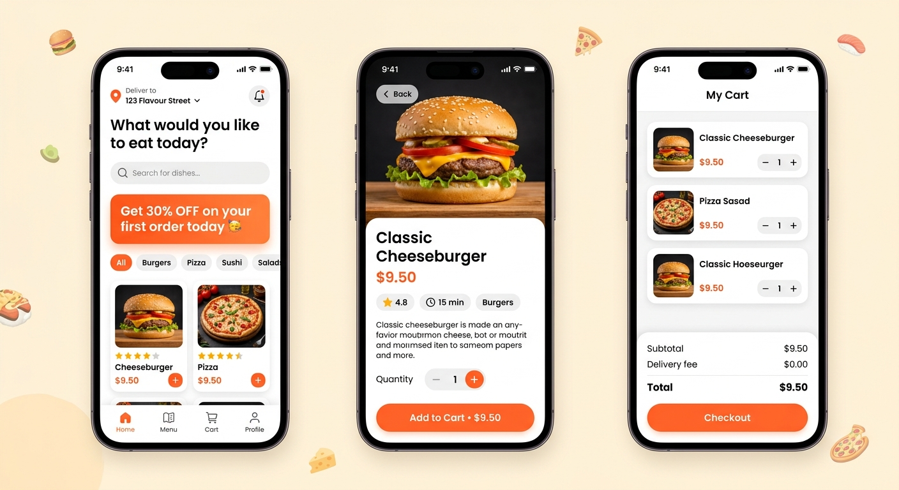

# 🍔 Tasty Bites — Flutter Restaurant App

A modern, polished restaurant ordering app built with **Flutter** and Material 3.



## ✨ Features

- **Home** — location bar, search, promo banner, category filter chips, and a dish grid
- **Menu** — full searchable list of dishes
- **Dish Detail** — large hero, rating/time/category chips, quantity selector, add-to-cart
- **Cart** — quantity editing, live subtotal + delivery fee + total, checkout dialog
- **Profile** — account screen with settings list
- **State management** with `provider` (cart persists across tabs)
- Clean Material 3 theming with `google_fonts` (Poppins)
- Emoji-based dish art (no asset downloads needed — works offline out of the box)

## 📁 Project Structure

```
tasty_bites/
├── pubspec.yaml
└── lib/
    ├── main.dart                  # App entry, theme, provider
    ├── models/
    │   └── dish.dart              # Dish data model
    ├── data/
    │   └── sample_data.dart       # Categories + sample dishes
    ├── providers/
    │   └── cart_provider.dart     # Cart state (ChangeNotifier)
    ├── widgets/
    │   └── dish_card.dart         # Reusable dish grid card
    └── screens/
        ├── root_nav.dart          # Bottom navigation shell
        ├── home_screen.dart
        ├── menu_screen.dart
        ├── dish_detail_screen.dart
        ├── cart_screen.dart
        └── profile_screen.dart
```

## 🚀 Getting Started

1. Make sure you have Flutter installed: https://docs.flutter.dev/get-started/install
   ```bash
   flutter --version   # Flutter 3.x recommended
   ```

2. From the project root, fetch dependencies:
   ```bash
   cd tasty_bites
   flutter pub get
   ```

3. Run on a connected device or emulator:
   ```bash
   flutter run
   ```

   To build a release APK (Android):
   ```bash
   flutter build apk --release
   ```

> **Note:** This repo contains the Dart source (`lib/`) and `pubspec.yaml`. To generate the
> platform folders (`android/`, `ios/`, `web/`), run `flutter create .` inside the project once.

## 🎨 Customizing

- **Brand color** — change `seed` in `lib/main.dart`
- **Menu items** — edit `lib/data/sample_data.dart`
- **Real images** — swap the `emoji` field for `Image.network(...)` / `Image.asset(...)` in `dish_card.dart`, `menu_screen.dart`, and `dish_detail_screen.dart`

## 📄 License

Released under the [MIT License](LICENSE).

Enjoy! 🍽️
